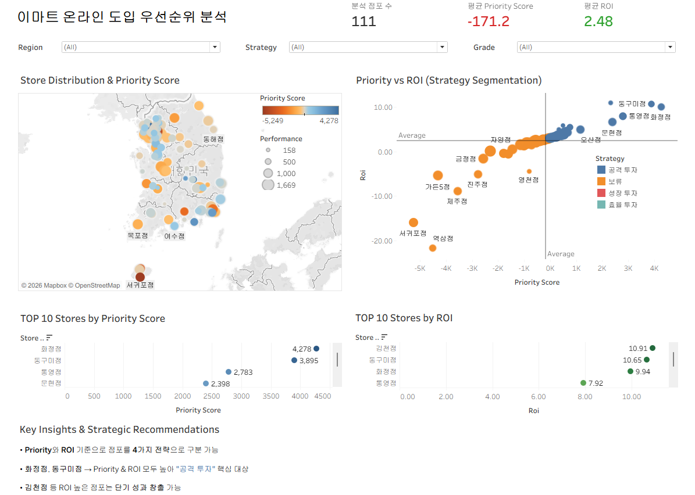
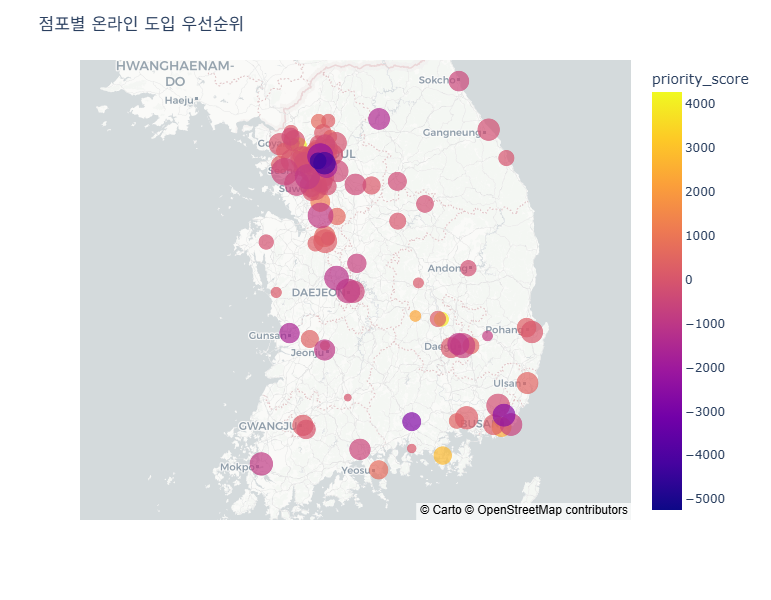

# 이마트 점포 온라인 도입 우선순위 분석 프로젝트

---

## 프로젝트 개요

오프라인 중심 유통 환경에서
**어떤 점포에 온라인 서비스를 먼저 도입해야 하는가?**를 데이터 기반으로 판단하기 위한 프로젝트입니다.

점포별 매출, 인구, 경쟁 환경 데이터를 통합하여
**온라인 도입 기대 효과(ROI)**와
**우선순위(priority_score)**를 정량적으로 산출했습니다.

---

## Tableau 대시보드

본 프로젝트의 분석 결과는 Tableau 대시보드를 통해 시각적으로 확인할 수 있습니다.

**Tableau Public Dashboard**
https://public.tableau.com/views/emart_online_priority_analysis/dashboard

### Dashboard Preview

### 주요 기능

- 점포별 우선순위 및 ROI 비교
- 전략별 점포 필터링
- 지역 기반 분석

**실제 의사결정에 활용 가능한 인터랙티브 분석 환경**

---

## 문제 정의

- 모든 점포에 온라인 서비스를 동시에 도입하는 것은 **비효율적**
- 점포별 상권 특성이 다르기 때문에 **데이터 기반 우선순위 결정 필요**

---

## 해결 접근

### 1️⃣ 데이터 수집 및 통합

- 이마트 점포 크롤링
- 내부 매출 / 매장 데이터 결합
- 외부 API 활용:
    - 인구 / 가구 수 (공공데이터)
    - 경쟁 점포 수 (카카오 API)
    - 좌표 변환 (VWorld API)

### 2️⃣ Feature Engineering

- **competition_index** = 경쟁 점포 + 상권 밀도
- **demand_competition_ratio** = 인구 / 경쟁
- **store_efficiency** = 매출 / 면적
- **parking_per_area** = 주차 / 면적

상권 구조 기반 분석

### 3️⃣ 매출 예측 모델

- 모델: Gradient Boosting Regressor
- 목표: 점포별 **잠재 매출(predicted_sales)** 추정

---

## 핵심 지표 정의

### 📌 Opportunity Gap

opportunity_gap = predicted_sales - actual_sales

점포의 **잠재력 대비 현재 성과 차이**

### 📌 Priority Score

priority_score = opportunity_gap × log(population)

온라인 도입 **전략적 우선순위**

### 📌 ROI

expected_after_online = predicted_sales × 1.15
estimated_cost = predicted_sales × 0.05

ROI = (expected_after_online - actual_sales) / estimated_cost

투자 대비 수익성 (효율성)

---

## 실행 결과

### Feature Importance

| Feature | Importance |
|---------|------------|
| area_log | 0.6088 |
| competition_log | 0.0984 |
| population_log | 0.0981 |
| parking_per_area | 0.0715 |
| household_size | 0.0633 |
| demand_competition_ratio | 0.0598 |

**매장 면적이 매출에 가장 큰 영향**

### 모델 성능

- RMSE: **227.77**
- R²: **0.502**

절대값 예측보다 **점포 간 상대 비교에 적합**

---

## Priority Score 기준 TOP 10

| 순위 | 점포 | Score |
|------|-----|-------|
| 1 | 화정점 | 4278.12 |
| 2 | 동구미점 | 3895.02 |
| 3 | 통영점 | 2782.57 |
| 4 | 문현점 | 2398.02 |
| 5 | 김천점 | 2317.98 |
| 6 | 오산점 | 1160.75 |
| 7 | 과천점 | 769.10 |
| 8 | 여수점 | 663.32 |
| 9 | 양주점 | 620.59 |
| 10 | 검단점 | 613.24 |

**전략적 우선 투자 대상 점포**

---

## ROI 기준 TOP 10

| 순위 | 점포 | ROI |
|------|-----|-----|
| 1 | 김천점 | 10.91 |
| 2 | 동구미점 | 10.65 |
| 3 | 화정점 | 9.94 |
| 4 | 통영점 | 7.92 |
| 5 | 문현점 | 6.59 |
| 6 | 에코시티점 | 5.89 |
| 7 | 과천점 | 5.38 |
| 8 | 신촌점 | 4.92 |
| 9 | 오산점 | 4.92 |
| 10 | 양주점 | 4.75 |

**투자 대비 수익성이 높은 점포**

---

## 투자 전략 분류

점포를 **Priority Score + ROI 기준으로 4가지 전략으로 분류**

| 전략 | 의미 |
|------|-----|
| 🚀 공격 투자 | 높은 우선순위 + 높은 ROI |
| 📈 성장 투자 | 높은 우선순위 + 낮은 ROI |
| 💰 효율 투자 | 낮은 우선순위 + 높은 ROI |
| ❌ 보류 | 낮은 우선순위 + 낮은 ROI |

### 전략 분포

- 공격 투자: **55개**
- 보류: **54개**
- 성장 투자: **1개**
- 효율 투자: **1개**

---

## 핵심 인사이트

- **화정점, 동구미점**
    Priority + ROI 모두 높음 → **최우선 공격 투자 대상**

- 일부 점포는 ROI는 높지만 Priority는 낮음
    **단기 수익 중심 투자 후보**

- 대부분 점포는 보류 구간
    **선별적 투자 전략 필요**

- 전략 분포가 극단적으로 나타남
    **데이터 기반 투자 기준의 중요성 확인**

---

## 시각화 결과

### 점포별 온라인 도입 우선순위 지도

- 색상: Priority Score
- 크기: 매출

전국 단위 투자 전략 직관화

---

## 실행 방법

### 환경 세팅

python -m venv venv  
venv\Scripts\activate  
pip install -r requirements.txt

### 환경 변수 설정 (.env)

본 프로젝트는 외부 API를 사용하므로 '.env' 파일이 필요합니다.  
루트 디렉토리에 '.env' 파일을 생성하고 '.env.example'을 참고하여 API key값을 입력해주세요.

### 전체 파이프라인 실행

python main.py --pipeline

### 분석만 실행

python main.py

---

## 프로젝트 구조

├── data/    
│ ├── raw/    
│ ├── processed/   
│ └── cache/    
│    
├── src/    
│ ├── data/  
│ ├── features/  
│ ├── models/  
│ ├── evaluation/  
│ ├── visualization/    
│ └── utils/    
│    
├── images/     
|    
├── dashboard/    
│    
├── .gitignore    
│    
├── .env    
│    
├── main.py    
│    
├── requirements.txt    
│    
└── README.md    

---

## 프로젝트 의의

- 데이터 기반 투자 의사결정 지원
- 온라인 전환 전략 수립
- 점포별 맞춤 전략 도출
